## PROYECTO FINAL: DJANGO + TERRAFORM + AZURE

### 📌 OBJETIVO: 
Desplegando una API Django en Azure con Terraform Cloud

### 📌 🏗️ ARQUITECTURA IMPLEMENTADA

1️⃣ Código de Aplicación (zenya-backend)
```bash
- API REST con Django REST Framework
- Autenticación JWT
- PostgreSQL como base de datos
- Dockerizado con Gunicorn como WSGI server
```

2️⃣ Infraestructura como Código (zenya-infra)
```bash
- Terraform con módulos reutilizables:
  - PostgreSQL Flexible Server (B1ms para staging)
  - Azure Container Instances (1 vCPU, 1.5GB RAM)
  - Networking y firewall rules
  - Resource Groups
- Estado remoto gestionado por Terraform Cloud
- Variables sensibles separadas del código
```

3️⃣ CI/CD Pipeline
```bash
- Continuous Integration:
  - Tests automáticos en cada PR
  - Build y push de imágenes Docker a DockerHub
  - Validación de migraciones de Django
- Continuous Deployment (en implementación):
  - Trigger automático desde GitHub a Terraform Cloud
  - Actualización de containers con nuevas imágenes
  - Zero-downtime deployments
```

### 🔧 STACK TECNOLÓGICO
```bash
Backend:
- Django 4.2+ con Django REST Framework
- PostgreSQL 15
- Gunicorn + WhiteNoise
- JWT Authentication

DevOps:
- Terraform Cloud (remote state + workspace management)
- GitHub Actions (CI/CD pipeline)
- Docker (python:3.12-slim optimizado)
- Azure Container Instances
- Azure Database for PostgreSQL

Herramientas:
- DataGrip (gestión de BD)
- Insomnia (testing de APIs)
- Azure CLI (troubleshooting)
```

### 📚 APRENDIZAJES CLAVE

1️⃣ Separación de Responsabilidades
Mantener el código de la aplicación separado de la infraestructura facilita el mantenimiento y permite workflows independientes.

2️⃣ Terraform Cloud como Game Changer
- Estado remoto compartido
- Ejecución remota de plans/applies
- UI para revisar cambios antes de aplicar
- Variables sensibles encriptadas

3️⃣ Optimización de Docker
- python:slim reduce la imagen de 1GB a 250MB
- Collectstatic en build time
- Healthchecks para container management
- Usuario no-root para seguridad

4️⃣ Configuration Management
- Variables de entorno para diferentes ambientes
- Secrets separados por workspace
- Configuración específica para GitHub Actions vs Azure

5️⃣ Troubleshooting en Producción
- Logs centralizados con Azure CLI
- Exec en containers para debugging
- Healthchecks para monitoreo proactivo

### 💰 GESTIÓN DE COSTOS
Uno de los mayores beneficios de IaC: destrucción completa de recursos cuando no se usan.

- Staging activo: ~$1.50/día
- Staging destruido: $0.00/día
- Un simple `terraform destroy` elimina todo

Esto permite iterar rápidamente sin preocuparse por costos acumulados.

### 🎯 RESULTADOS
✅ Backend funcionando en Azure
✅ Migraciones de Django ejecutadas
✅ Static files servidos correctamente
✅ Admin de Django accesible con estilos
✅ APIs probadas con Insomnia
✅ Conexión a PostgreSQL verificada con DataGrip
✅ Infraestructura reproducible en ~10 minutos


### 📷 CAPTURAS

```bash
1. Lista de Resource Manager | Grupos de recursos
```
<p align="center">
  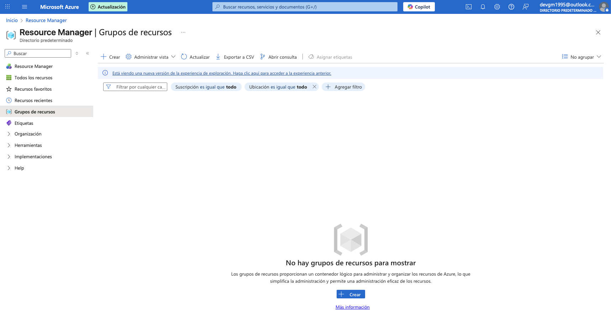
</p>

```bash
2. Pusheo del código de la infraestructura
```
<p align="center">
  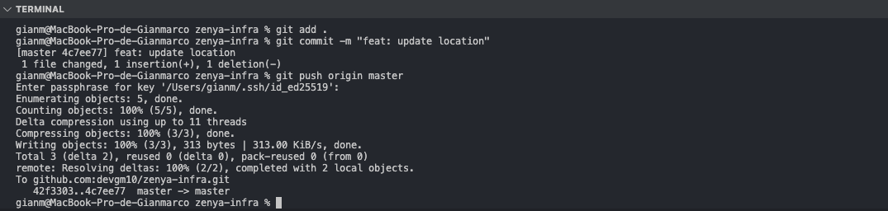
</p>

```bash
3. Verificación en terraform cloud del pusheo de la infraestructura
```
<p align="center">
  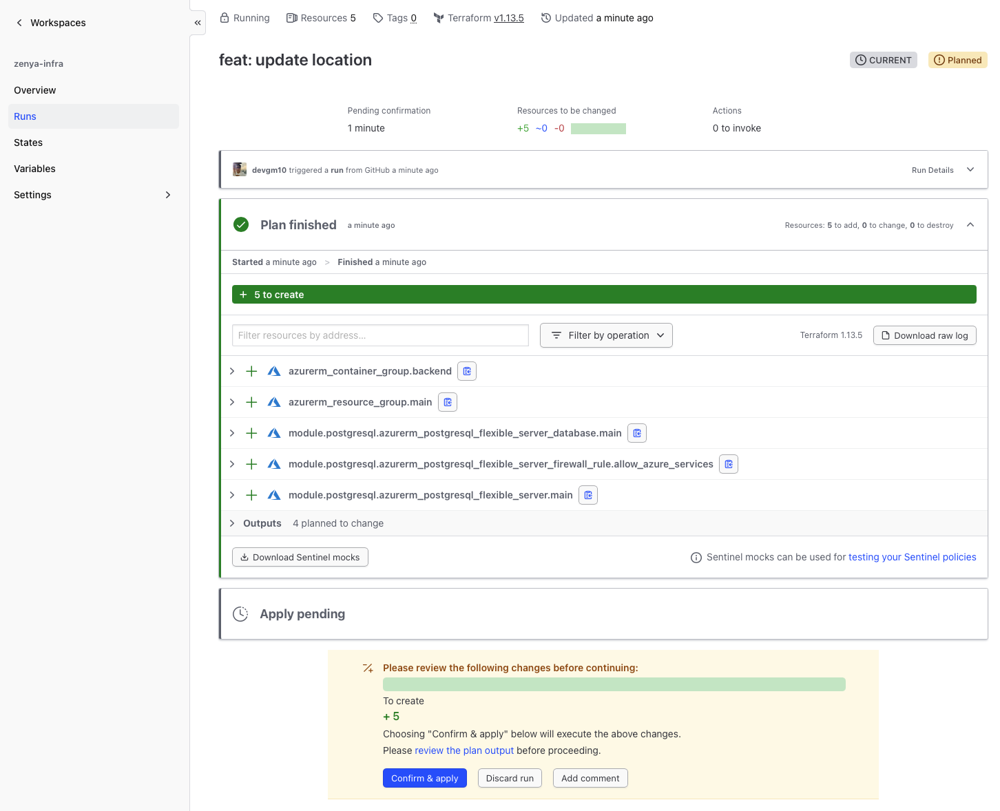
</p>

```bash
4. Confirmación de running apply
```
<p align="center">
  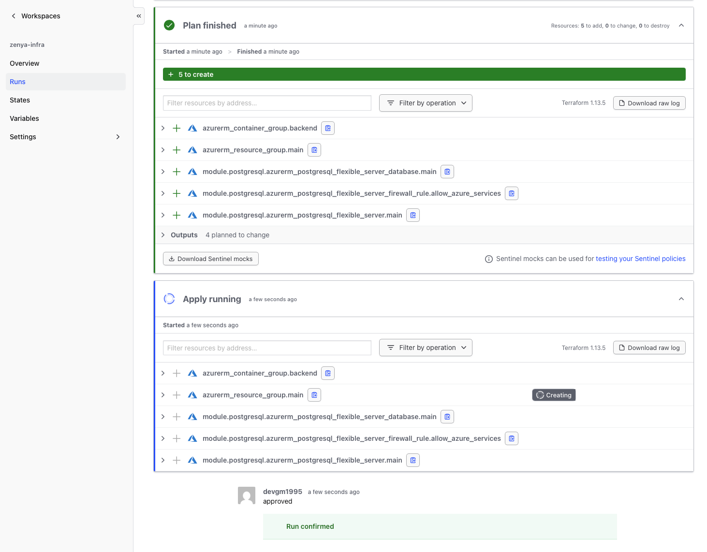
</p>

```bash
5. Latest run
```
<p align="center">
  
</p>

```bash
6. Verificación de creación de Resource Manager | Grupos de recursos
```
<p align="center">
  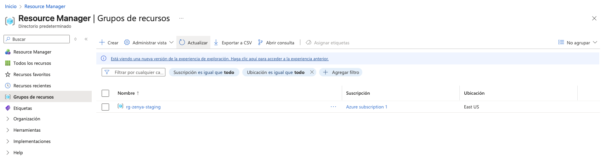
</p>

<p align="center">
  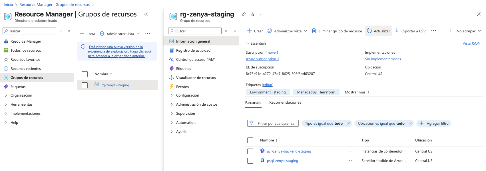
</p>

```bash
7. Configuración de mi IP Pública
```
<p align="center">
  
</p>

```bash
8. Conexión de mi DB a través de DataGrip
```
<p align="center">
  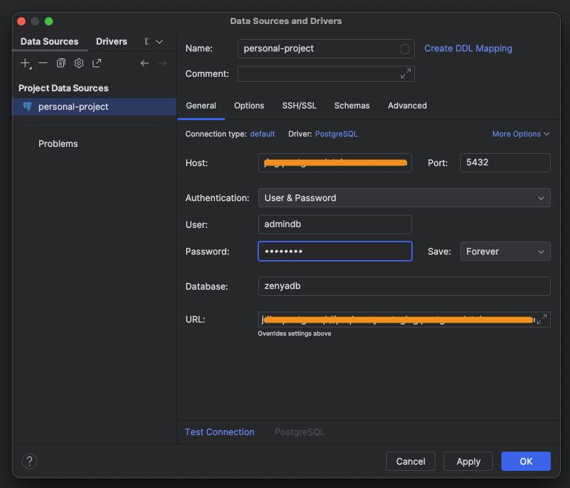
</p>


```bash
9. Migración inicial y creación de super user
```
<p align="center">
  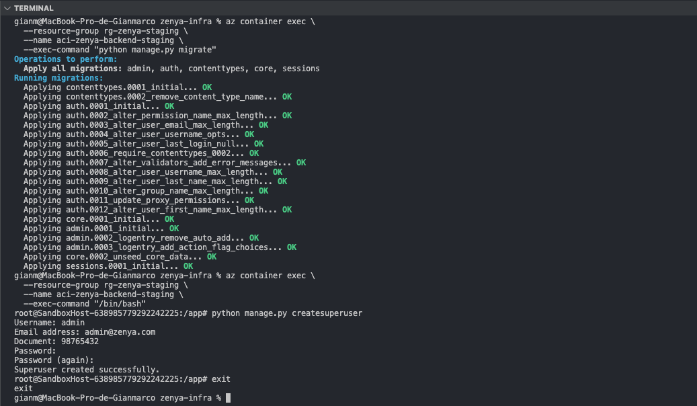
</p>

```bash
10. Verificación de la Migración inicial
```
<p align="center">
  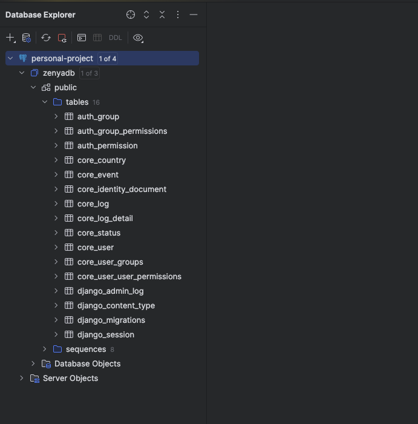
</p>

<p align="center">
  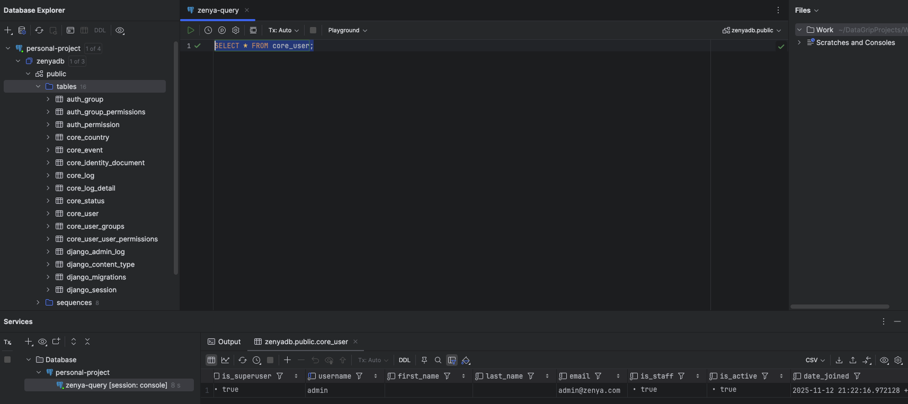
</p>

```bash
11. Verificación de Django admin
```
<p align="center">
  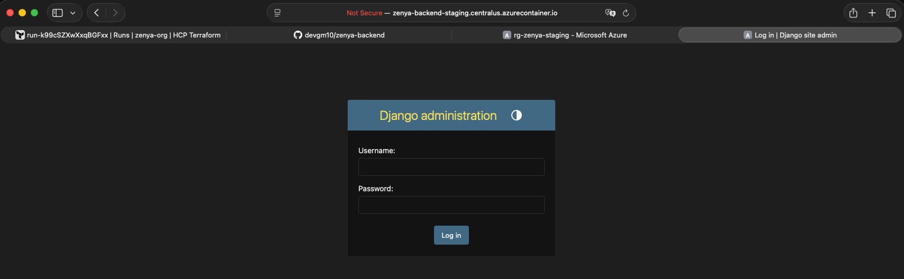
</p>

<p align="center">
  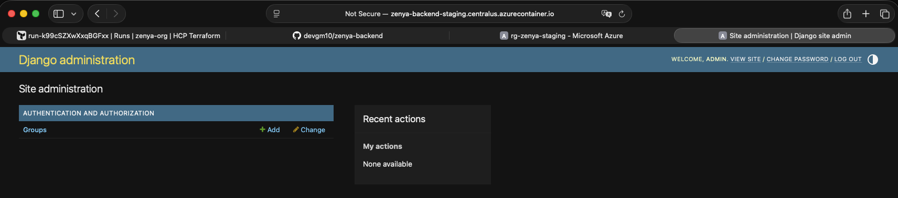
</p>

```bash
11. APIs TEST en Insomnia
```
<p align="center">
  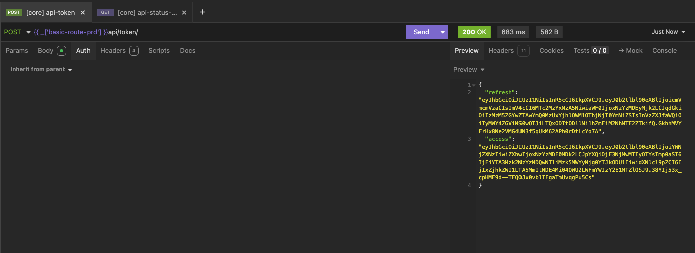
</p>

<p align="center">
  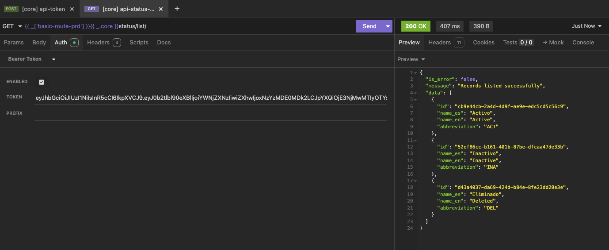
</p>